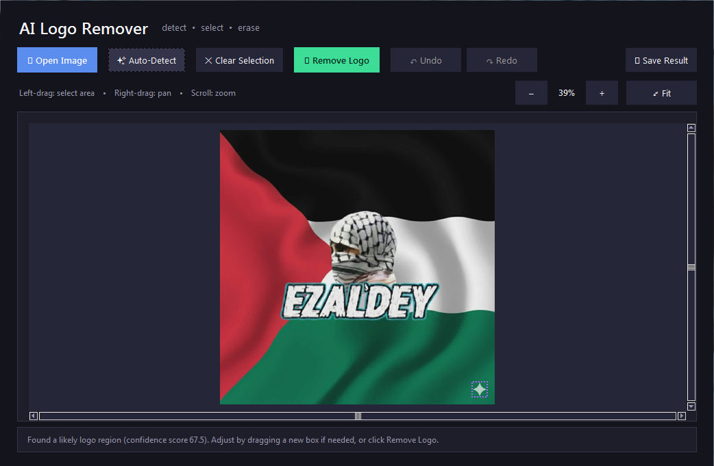

# Gemini Logo Remover 🧽✨

A desktop application built with Python (**Tkinter** and **OpenCV**) designed to effortlessly erase logos, text, watermarks, and unwanted objects from images. It offers a unique dual-mode workflow: an intelligent, zero-overhead heuristic corner scanner for instant automatic localization, alongside a pixel-perfect click-and-drag manual selection box equipped with sub-region contour tuning.

<!-- Preview Screenshot Panel -->
<p align="center">
  
</p>

---

## 🚀 Key Features

- **Dual Detection Workflow**:
  - ✨ **Heuristic Auto-Detect**: Analyzes the image corners for high edge density and distinctive color/saturation variance on uniform backgrounds—the signature of almost every application or AI-generated watermark.
  - 🖱️ **Manual Selection with Intelligent Auto-Refinement**: Drag an approximate box around the logo; the app automatically shrinks and fits the bounding box around the sharpest, most isolated internal contour.
- **Advanced Editing Canvas**:
  - 🔄 **Full History Stack**: Multi-level undo (`Ctrl+Z`) and redo (`Ctrl+Y` / `Ctrl+Shift+Z`) state management.
  - 🔍 **Interactive Zoom & Pan**: Fluid viewport zoom centered on your mouse wheel cursor (up to 800%) and smooth right-click panning to navigate high-resolution images easily.
  - 💧 **Seamless Inpainting**: Uses the state-of-the-art Fast Marching Method (`INPAINT_TELEA`) with localized feathering, blur-mask blending, and custom edge padding to prevent color bleeding.
- **Modern UI & UX**:
  - 🎨 **Deep Charcoal Palette**: A custom, elegant dark theme designed to reduce eye strain and focus purely on your media.
  - 📥 **Drag-and-Drop Native Pipeline**: Integrated file dropping (`tkinterdnd2`) support allows you to drag files straight from your system explorer onto the window canvas.

---

## 🛠️ Requirements & Installation

The application requires Python 3.x and relies on three main packages for processing, array computing, and image presentation.

### 1. Install Base Dependencies
```bash
pip install opencv-python pillow numpy
```

### 2. Enable Drag-and-Drop Support (Optional)
To unlock the ability to drag files directly into the workspace canvas, install `tkinterdnd2`:
```bash
pip install tkinterdnd2
```
*Note: If `tkinterdnd2` is absent, the application gracefully degrades to a standard file explorer prompt via the "Open Image" button.*

---

## 💻 Usage & Execution

Launch the application directly from your shell terminal:

```bash
python logo_remover.py
```

### Quick Workflow Step-by-Step:
1. **Load Media**: Click **📂 Open Image** or drag an image file (`.png`, `.jpg`, `.jpeg`, `.webp`, `.bmp`) directly onto the central canvas area.
2. **Target Selection**:
   - Click **✨ Auto-Detect** to scan all four corners automatically using edge density scoring.
   - *Or* click and drag with your **Left Mouse Button** over any portion of the image to mark a custom bounding box.
3. **Erase**: Press **🧽 Remove Logo**. The inpainting mask will compute behind the scenes and update instantly.
4. **Export**: Click **💾 Save Result** to choose an output path and file format.

---

## 🧠 Under the Hood: Technical Mechanics

### 1. Watermark Heuristic Detection
Because shipping heavy machine learning weights (e.g., YOLO or custom CNN checkpoints) would drastically bloat the binary size and introduce trademark concerns, this program uses a highly tuned mathematical heuristic scanner. 
It analyzes a `corner_fraction` parameter of the outer bounds, running a Canny edge detector ($60 	o 160$ thresholding matrix) followed by mathematical dilation to group broken strokes into monolithic blobs. It scores objects based on the following relationship:

$$	ext{Score} = (\sigma_{	ext{Saturation}} 	imes 0.6) + (	ext{Edge Density} 	imes 400)$$

This cleanly differentiates a colorful, high-contrast, text-heavy watermark from flat skies, gradients, or chaotic photographic backgrounds.

### 2. Alpha Bleed Masking
To hide pixel artifacts, the removal pipeline creates an isolated single-channel binary mask. It expands outward by an 8-pixel structural element padding value, runs a $9 	imes 9$ Gaussian blur matrix to feather hard geometric transitions, and thresholds the resulting array before running Telea's propagation engine. This prevents hard edge lines or pixel smear near high-contrast edges.

---

## ⌨️ Global Keybindings

| Key Combination | Action Description |
| :--- | :--- |
| **`Left-Click + Drag`** | Draw manual bounding selector |
| **`Right-Click + Drag`** | Pan image viewport around the canvas |
| **`Scroll Wheel`** | Dynamic zoom centered on current cursor coordinates |
| **`Ctrl + Z`** | Undo previous canvas operation |
| **`Ctrl + Y`** / **`Ctrl + Shift + Z`** | Redo canvas state |

---

## 📜 Disclaimer & Licensing

This software is provided for personal desktop utility, research, and backup workflows. It does not contain any hardcoded corporate asset footprints or proprietary trademarks. Always ensure you respect intellectual property boundaries and copyright laws when distributing edited photographic media. Distributed under the MIT License.
